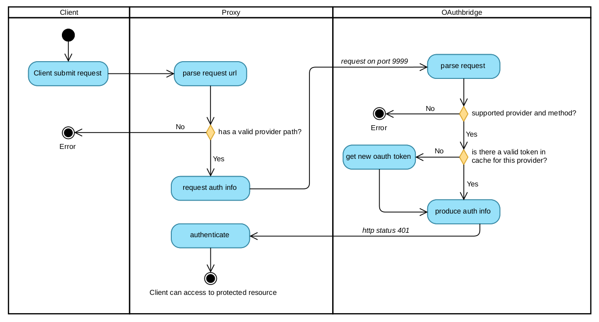

# OAuthbridge [](https://travis-ci.com/samuelecat/oauthbridge)&nbsp;[](https://codecov.io/gh/samuelecat/oauthbridge)
A reverse proxy that provides transparent authentication to resources protected by OAuth


## License
See the [LICENSE](LICENCE) file for details.


## Usage example

#### instructions for access to your Bitbucket repository:

1. From your Bitbucket account: find the OAuth settings, then generate a new *client id* and *client secret* and set its scope on *repository*.
2. Edit the file `./conf/configuration.yml` and under `providers` -> `bitbucket` set your `client_id`, `client_secret` and under `scopes` set `repository`
3. having installed docker and docker-compose, run from the root directory `docker-compose up -d`

At this point you should be able to access your Bitbucket repository replacing the base URL of your repository from 
`https://bitbucket.org/` to the one of the proxy `http://localhost:8081/bitbucket/`

Example:
```bash
git clone https://bitbucket.org/my-account/my-repo.git
```
become:
```bash
git clone http://localhost:8081/bitbucket/my-account/my-repo.git
```
the OAuthbridge will perform the authentication for you.

## How it works



1. A client, maybe you, makes a request `http://localhost:8081/{a provider}/..resource path..`
2. The reverse proxy, request for info the OAuthbridge service which is listening on port `9999` : `http://127.0.0.1:9999/{the provider from the client request}-info/....`
3. OAuthbridge returns the token plus other useful info needed by the proxy to perform the next step, the autentication on the provider endpoint. The http status is `401`.
4. The proxy can finally route the request from the client to the provider resource using authentication info.

*note it is possible to query the OAuthbridge service directly using for example curl:*
```bash
curl -i localhost:9999/bitbucket-info/my-account/my-cool-repository.git
```
*or being redirected to the provider resource:*
```bash
curl -L localhost:9999/bitbucket-redirect/my-account/my-cool-repository.git
```

## Advanced options

In the configuration file are present some more options:

* **query_params** : this are extra url query parameters that some providers may require
* **token_url** : this one is usually better to leave commented out because OAuthBridge knows what is the token url for each provider
* **expire_time** : set the expire time of the token in seconds, after this amount a new token will be requested from OAuthbridge to the provider. Note each provider has different expire time, setting this value over will only produce errors. The OAuthBridge default it's safer.

Editing the `nginx-server.conf` and rebuilding the docker image, you can change the entrypoint `http://localhost:8081`  For example you can use port 80 instead of 8081 (or the https 443 if you provide an ssl certificate) and maybe instead of `localhost` you can have a nicer domain.
